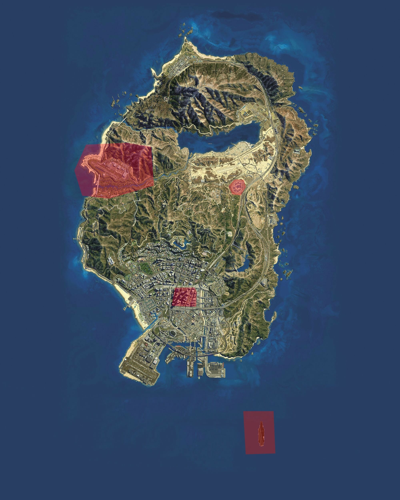

# Regels

1.  Als jij iets van een straf krijgt staat het daar in vermeld welke categorie jij hebt gekregen 
    * 1e categorie: Mondeling aanspreken en notitie in het personeelsbestand
    * 2e categorie: schriftelijke waarschuwing
    * 3e categorie: Je wordt gedemoveerd naar de eerste rang.
    * 4e categorie: Rang wordt herzien. Geld boete van 25.000 euro
    * 5e categorie: Ontslag
    * 6e categorie: Ontslag / Taken of ban

    Waarschuwingen zijn 3 maanden geldig, daarna vervallen ze automatisch.

    Heb je binnen 3 maanden 2x 1e categorie --> 2e categorie

    Heb je binnen 3 maanden 3x 2e categorie --> 3e / 5e categorie

## Algemene regels
* Toon respect naar je collega's & andere inwoners
* Join altijd de porto als je in dienst bent
* Zorg dat je altijd verbanddozen mee hebt
* Wees aardig en probeer zoveel mogelijk te helpen met een glimlach
* Vul je uren in
* Heb plezier in je werk!
* Je stuurt te allen tijde een factuur, tenzij mensen een contract hebben (Politie & ANWB) 

## Ovirige regels
* Hou je aan de verkeersregels voor zover mogelijk
* Naar meldingen rijden we altijd met de sirene aan
* wanneer je iemand achterin hebt, probeer rustig te rijden (houd rekening met je patiënt)
* Je veroorzaakt geen (zwaar) letsel
* we volgen bevelen van de politie altijd op
* We helpen iedereen
* Je ruimt je spullen op nadat je klaar bent. (Bij de Pooltafel neer leggen)
* zet een goede roleplay neer
* Onder rang 3 mag je nog UIT DIENST schieten en andere criminelen dingen doen.
* Zodra je op rang 3 zit en boven, mag je niet meer schieten of iemand vermoorden
* plukken mag nog op elke rang
* In dienst mag je NIET gokken, uit dienst wel
* Het is niet toegestaan in dienst te gaan puur om iemand te helpen met een wapen, en daarna uit dienst te gaan, je helpt iedereen gelijk.
* In dienst mag je niet samenwerken met criminelen 
* minimaal 1 sprinter in de stad aanwezig moet zijn.

Dus als je in dienst gaat en er is nog niemand in dienst ga je in een sprinter rond rijden en niet in een A6 of 
ander voertuig. Als er iemand bij komt, mag je overleggen wie de Sprinter overneemt. 

!!! failure " Let op "
    De straffen staan hier niet bij. Als jij iets van een straf krijgt staat het daarin vermeld welke categorie 
    jij hebt gekregen.

# Landen lifeliner

---------------------

*Dit boek is ontwikkeld door [15-04] Niels S., in samenwerking met Ambulance Directie en [10-12] Jeffrey L.*