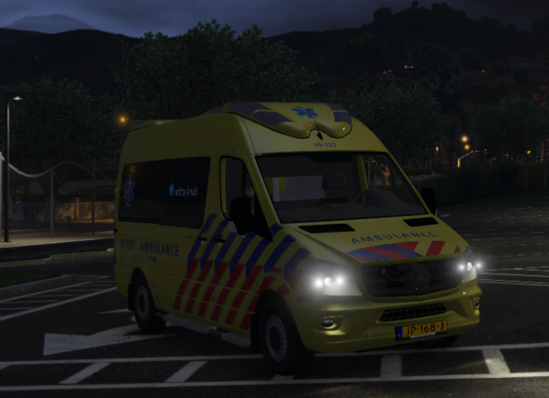
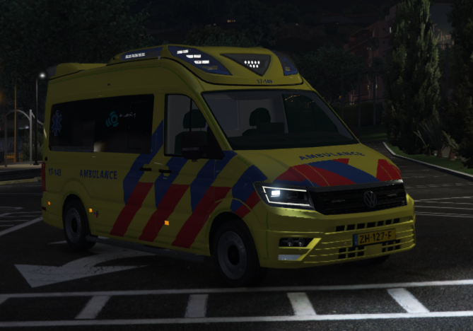
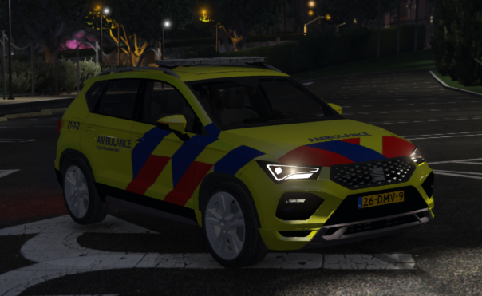
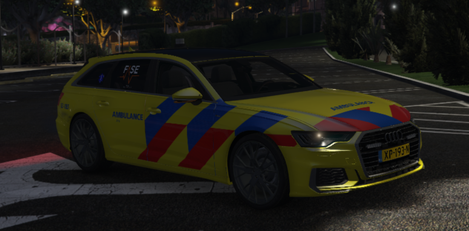
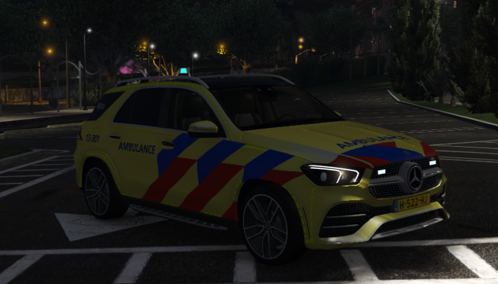
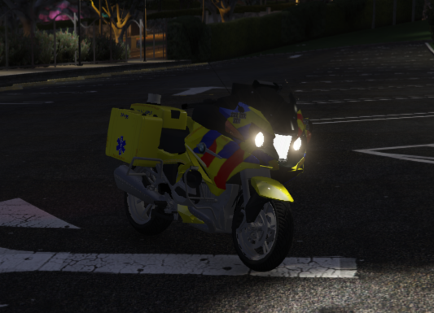
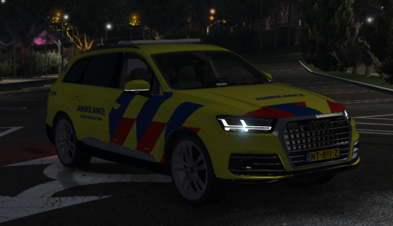
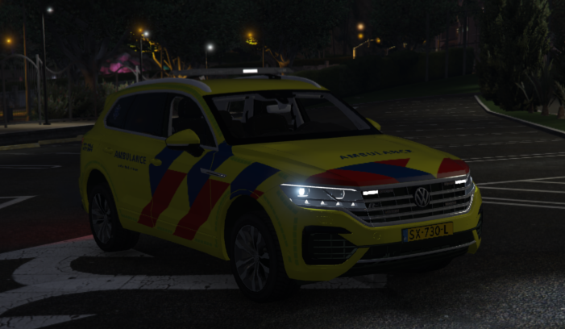
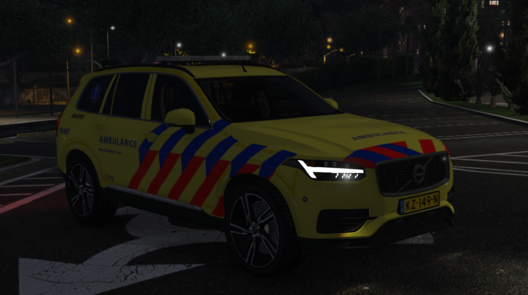

# Voertuigen

!!! attention "LET OP"
    We zijn er mee bezig hem dit klaar te maken

Binnen het ambulance team beschikken we over diverse voertuigen die je mag besturen zodra je de vereiste training hebt voltooid. Hieronder vind je een overzicht van de verschillende voertuigen en de bijbehorende rangen die bepalen wie welk voertuig mag besturen. Het succesvol afronden van specifieke trainingen is van cruciaal belang om de verantwoordelijkheid over bepaalde voertuigen binnen het team te mogen dragen. Het volgende schema geeft een duidelijk beeld van welke voertuigen aan welke rangen zijn gekoppeld, waardoor de inzetbaarheid van het ambulance team optimaal wordt gecoördineerd.

 Update volgt 
 
---------------------

 *Dit boek is ontwikkeld door Politie Overheidscoordinator Niels Smit, in samenwerking met Jeffrey L.*